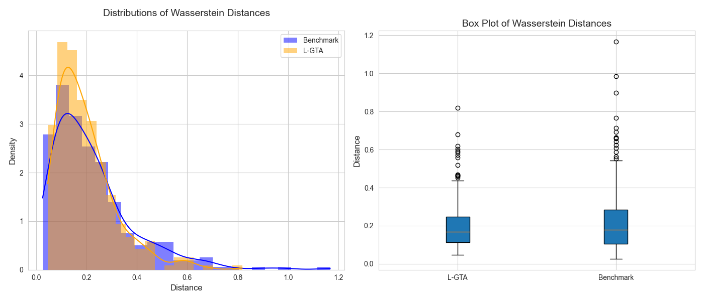

# L-GTA: Latent Generative Modeling for Time Series Augmentation

This repository contains the implementation of L-GTA, a novel methodology for time series augmentation leveraging transformer-based variational autoencoders. L-GTA introduces controlled transformations within the latent space to generate semi-synthetic time series data while preserving the intrinsic properties of the original dataset. This approach provides more reliable and consistent augmented data, enhancing predictive accuracy and similarity measures compared to traditional direct transformation methods. Figure 1 shows a diagram depicting the L-GTA framework for augmenting time series data. 

### Installation
After the peer review you will be able to install L-GTA as a Python package:

```python
pip install lgta
```

### Functionality
The main features of this repository include:

* **L-GTA Methodology**: Implementation of the L-GTA model, combining transformers, Bi-LSTMs, CVAEs, and a Variational Multi-Head Attention (VMHA) mechanism to generate semi-synthetic time series data.
* **Controlled Transformations**: Application of diverse transformations, such as jittering and magnitude warping, within a probabilistic latent space to maintain the statistical properties of the original dataset.
* **Augmented Data Generation**: Capability to generate new time series that mirror the effects of direct transformations while adhering closely to the statistical fidelity of the original sequences.
* **Evaluation Framework**: Methods for assessing the fidelity and predictive performance of the augmented data compared to original datasets.


###Getting Started

The code below demonstrates how to generate new versions of a sample time series dataset by applying L-GTA's latent space transformations.

```python
from lgta.model.create_dataset_versions_vae import (
    CreateTransformedVersionsCVAE,
)
from lgta.feature_engineering.feature_transformations import detemporalize
from lgta.e2e.e2e_processing import e2e_transformation


dataset = "tourism"
freq = "M"

create_dataset_vae = CreateTransformedVersionsCVAE(
    dataset_name=dataset, freq=freq, dynamic_feat_trig=False
)
model, _, _ = create_dataset_vae.fit()
dynamic_feat, X_inp, static_feat = create_dataset_vae.features_input

_, _, z = model.encoder.predict(dynamic_feat + X_inp + static_feat)
z_modified = None

preds = model.decoder.predict([z] + dynamic_feat + static_feat)

preds = detemporalize(preds, create_dataset_vae.window_size)
X_hat = create_dataset_vae.scaler_target.inverse_transform(preds)

X_orig = create_dataset_vae.X_train_raw
X_hat_orig = X_hat

########################################################################################
# Define parameters (this will be improved before making the repo publicly available, 
# making it easier for the user to set these parameters)
########################################################################################

transformations = [
    {
        "transformation": "jitter",
        "params": [0.9],
        "parameters_benchmark": {
            "jitter": 0.375,
            "scaling": 0.1,
            "magnitude_warp": 0.1,
            "time_warp": 0.05,
        },
        "version": 5,
    },
    {
        "transformation": "scaling",
        "params": [0.3],
        "parameters_benchmark": {
            "jitter": 0.375,
            "scaling": 0.1,
            "magnitude_warp": 0.1,
            "time_warp": 0.05,
        },
        "version": 4,
    },
    {
        "transformation": "magnitude_warp",
        "params": [0.4],
        "parameters_benchmark": {
            "jitter": 0.375,
            "scaling": 0.1,
            "magnitude_warp": 0.1,
            "time_warp": 0.05,
        },
        "version": 4,
    },
]

########################################################################################
# e2e comparison
########################################################################################

results = {}
for transformation in transformations:
    results[transformation["transformation"]] = e2e_transformation(
        dataset,
        freq,
        model,
        z,
        dynamic_feat,
        static_feat,
        create_dataset_vae,
        transformation["transformation"],
        transformation["params"],
        transformation["parameters_benchmark"],
        transformation["version"],
        X_orig,
        X_hat,
    )
```

### Experimental Results

We conducted extensive experiments to evaluate the impact of L-GTA on time series augmentation across multiple real-world datasets. The primary findings from our analysis are summarized below:

#### Key Findings

1. **Comparison of Augmentation Methods (Q1)**: 
   - **Figure 2**: The comparison of jittering and magnitude warping transformations using L-GTA and direct methods on time series data. L-GTA produces consistent transformations with slight fluctuations or stretched magnitudes without introducing extreme values or artificial distortions. In contrast, direct transformations occasionally lead to erratic series deviations.
   - **Figure 3**: Distribution of residuals for jittering transformation shows skewed residuals for direct methods, indicating a bias not present in L-GTA. L-GTA manages to avoid this skewness by learning from the original data patterns.

2. **Consistency of Transformations (Q2)**:
   - L-GTA consistently produces transformations that maintain the intrinsic patterns and characteristics of the original time series. This is particularly evident in transformations like magnitude warping, where direct methods sometimes lead to extreme distortions, while L-GTA maintains a more regular and controlled transformation.

3. **Distribution of Distances (Q3)**:
   - **Figure 4**: Pairwise Wasserstein distances for the Tourism dataset show that L-GTA exhibits a more concentrated distribution with fewer outliers and reduced skewness compared to direct methods.
   - **Table 1**: Wasserstein distance results across the Tourism, M5, and Police datasets demonstrate that L-GTA achieves lower median distances and more consistent variability across different transformations compared to direct methods.

4. **Reconstruction Error (Q3)**:
   - **Table 2**: Reconstruction error results indicate that L-GTA retains the characteristics of the original dataset better than direct methods. L-GTA shows errors close to the original data, while direct methods exhibit larger oscillations and higher reconstruction errors.

5. **Predictive Performance (Q4)**:
   - **Table 3**: Prediction error analysis using a simple RNN model shows that L-GTA maintains predictive performance close to the original datasets across different transformations, demonstrating its ability to preserve the predictive characteristics of the original time series. Direct methods, on the other hand, show greater deviations from the original performance.

#### Figures and Tables

**Figure 1: Diagram depicting the L-GTA framework for augmenting time series data. This method combines Bi-LSTMs and CVAEs with a Variational Multi-Head Attention (VMHA) mechanism to generate semi-synthetic time series data. The learned latent space is transformed by applying time series augmentation
techniques such as jittering and magnitude warping.**


**Figure 2: Effects of L-GTA vs. Direct Methods on Time Series Data**


**Figure 3: KDE of Residuals Distribution for Jittering Transformation**


**Figure 4: Wasserstein Distance for Tourism Dataset**


**Table 1: Wasserstein Distance Results**
| Dataset         | Metric | Jitter (L-GTA) | Jitter (Direct) | Magnitude Warp (L-GTA) | Magnitude Warp (Direct) | Scaling (L-GTA) | Scaling (Direct) |
|-----------------|--------|----------------|-----------------|------------------------|-------------------------|-----------------|------------------|
| Tourism Dataset | Median | 0.123          | 0.181           | 0.116                  | 0.182                   | 0.111           | 0.135            |
|                 | IQR    | 0.110          | 0.059           | 0.098                  | 0.194                   | 0.106           | 0.113            |
| M5 Dataset      | Median | 0.108          | 0.194           | 0.108                  | 0.411                   | 0.109           | 0.310            |
|                 | IQR    | 0.108          | 0.063           | 0.107                  | 0.405                   | 0.109           | 0.321            |
| Police Dataset  | Median | 0.123          | 0.302           | 0.165                  | 0.157                   | 0.158           | 0.156            |
|                 | IQR    | 0.062          | 0.037           | 0.063                  | 0.082                   | 0.063           | 0.047            |

**Table 2: Reconstruction Error Results**
| Dataset         | Transformation  | L-GTA   | Direct |
|-----------------|------------------|---------|--------|
| Tourism Dataset | Jitter           | 100.1%  | 168.7% |
|                 | Magnitude Warp   | 102.6%  | 185.4% |
|                 | Scaling          | 107.6%  | 244.1% |
| M5 Dataset      | Jitter           | 101.0%  | 156.9% |
|                 | Magnitude Warp   | 101.0%  | 180.6% |
|                 | Scaling          | 100.9%  | 254.1% |
| Police Dataset  | Jitter           | 99.6%   | 107.4% |
|                 | Magnitude Warp   | 98.5%   | 126.9% |
|                 | Scaling          | 97.0.4% | 129.9% |

**Table 3: Prediction Error Results**
| Dataset         | Transformation  | Original | L-GTA  | Direct |
|-----------------|------------------|----------|--------|--------|
| Tourism Dataset | Jitter           | 0.022    | 0.022  | 0.023  |
|                 | Magnitude Warp   | 0.022    | 0.022  | 0.025  |
|                 | Scaling          | 0.022    | 0.021  | 0.025  |
| M5 Dataset      | Jitter           | 0.049    | 0.048  | 0.051  |
|                 | Magnitude Warp   | 0.049    | 0.049  | 0.064  |
|                 | Scaling          | 0.049    | 0.046  | 0.069  |
| Police Dataset  | Jitter           | 0.037    | 0.037  | 0.036  |
|                 | Magnitude Warp   | 0.037    | 0.037  | 0.038  |
|                 | Scaling          | 0.037    | 0.037  | 0.038  |

### Contributing
We welcome contributions to L-GTA. If you find a bug or have ideas for new features, please open an issue or submit a pull request.

### License
This repository is licensed under the BSD 3-Clause License. See the LICENSE file for more information.